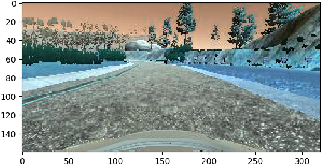
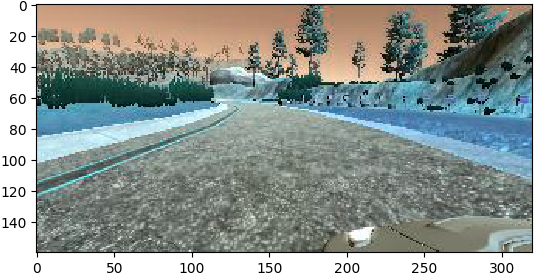
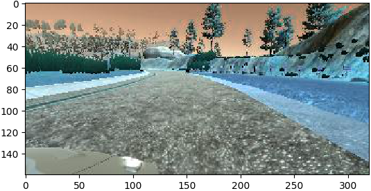
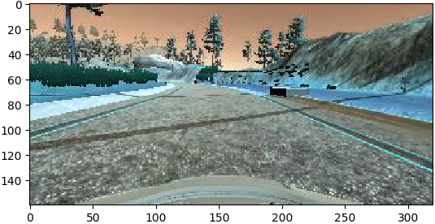
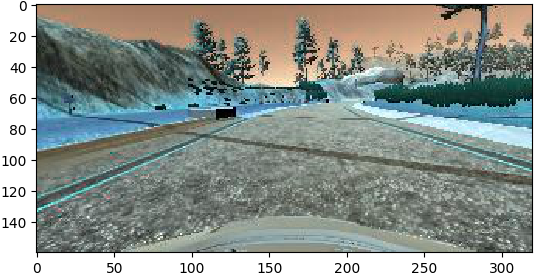

#**Behavioral Cloning** 
---

**Behavioral Cloning Project (P3)**

The goals / steps of this project are the following:

* Use the simulator to collect data of good driving behavior
* Build, a convolution neural network in Keras that predicts steering angles from images
* Train and validate the model with a training and validation set
* Test that the model successfully drives around track one without leaving the road
* Summarize the results with a written report


Here I will consider the [rubric points](https://review.udacity.com/#!/rubrics/432/view) individually and describe how I addressed each point in my implementation.  

---
###Files Submitted & Code Quality

####1. Submission includes all required files and can be used to run the simulator in autonomous mode

My project includes the following files:

* model.py containing the script to create and train the model
* drive.py for driving the car in autonomous mode
* model.h5 containing a trained convolution neural network 
* writeup\_report.md or writeup_report.pdf summarizing the results
* Two videos have been attached in the submission folder. Links available below:

[Video 1: Birdseye view of the autonomous driving in track 1](./video_birdseye.mp4) 

[Video 2: Dashcam view of autonomous driving in track 1](./video_dashcam.mp4)

####2. Submission includes functional code
Using the Udacity provided simulator and my drive.py file, the car can be driven autonomously around track 1 by executing 
```sh
python drive.py model.h5
```

***During testing, the simulator was configured to a resolution of 640x480 and the graphics quality was set to 'fantastic'.*

####3. Submission code is usable and readable

The model.py file contains the code for training and saving the convolution neural network. The file shows the pipeline I used for training and validating the model, and it contains comments to explain how the code works. To use pre-trained model and to train on new network, the model.py offers flags to do that, heres an example:
```python model.py --pretrained_model model_checkpoint.h5
```
, assuming that *model_checkpoint.h5* is the base model from which weights will be used for further training.  The comments are placed write before the code/method is introduced.


###Model Architecture and Training Strategy

####1. An appropriate model architecture has been employed
My model is a Convolutional Neural Network based on the architecture proposed by Nvidia team as was introduced in the classroom lecture.  However, I have slightly tweaked the model to accommodate overfitting issues (low training loss with with high validation loss and poor performance in testing).  The model is coded in line 88-118 within model.py.

The model consists of two pre-processing layers, first the Lamda layer to normalize the images between -1.0 and +1.0;  next, a cropping layer to crop the images to focus on the usable portion of the view/image.  After that, five convolution layers appear, among which three are 5x5 filter and other two are 3x3 filter.  The convolutional layers basically stretches it from depth from 24 to 64.  Each layer is activated with 'ReLU' and the variables are randomly initialized and are normally distributed.  The 'ReLU' helps to create a differentiable function (removes non-linearities) when errors back propagate during optimization and error minimization. Finally, the output is flattened and the depth is reduced from 100 to 1 using four Dense layers ( i.e., 100->50->10->1 ).  


####2. Attempts to reduce overfitting in the model
In order to reduce chances of overfitting, I have adopted techniques like shuffling data prior to training ( thanks to sci-kit's shuffle utility adopted in line 39), separated 20% of training data to use as validation set (again thanks to sci-kit as adopted in line 40).  Above all, I have added dropout layers in my model.  After few trial and error attempts of training, validation and testing (using Udacity Simulator), I finally converged with a model that has dropout layers integrated after almost every layer of the network, wherein the best dropout rate 0.25 obtained (via trial & error) was 0.25 (see line 88-118 in model.py). 

After training the model, it was tested in simulator.  Links of successful completion of autonomous driving in loop-1 is shared above in this writeup ( both dash-cam video and birds-eye video are available).


####3. Model parameter tuning
Tuning has been a great experience in this project.  Among the hyper-parameters (i.e., dropout rate, batch size, number of epochs, and training rate), I found dropout rate was most influential to the performance of the model in this project.  I found the rate to be optimal at 0.25 (even though aggressive) for this case.  Rest of the parameters did not have much influence on the performance of the model.  In addition to that, I have used Adam optimizer for loss optimization, which thankfully tunes learning rate, so I did not have to tune it manually.  


####4. Appropriate training data
Data augmentation has been a useful technique in this project.  I have used images/views from all three cameras and also doubled the number of images data by flipping them to overcome bias-ness of the model.  Prior to these augmentation, the autonomous driven car was veering to the left in loop 1, which made sense as the training data from loop 1 had lot of leftward turn than rightward ones.  While using images from left and right camera, I had to account for the offset, which I had manually tuned to 0.05 (degrees steering angle) correction factor in this case.


###Model Architecture and Training Strategy

####1. Solution Design Approach
In order to develop the solution, I have adopted a simple step-by-step design approach.  First I made a basic pipeline for this project in the following steps:

* Collecting training data using simulator training mode.
* Importing data from only center camera into model pipeline.
* Pre-processing data, in particular normalizing it (for better numerical stability during loss optimization).
* Creating a basic model (one layer and then LeNet architecture).
* Training and validating the model.
* Testing the model again in simulation autonomous mode.

Once I was satisfied with the basic pipeline, I started adding complexity to the model.  Based on experiences from past projects and the test result of the initial pipeline, most of the improvement effort went into processing of input data and designing/tuning of the neural network.  

I have started with the classic 'LeNet' model and built the initial pipeline; then shortly after few run of training and testing I realized, I need to add more complexity to the model.  Basically, the car was unable to stay on track even for a short distance of loop-1.  This led me to use Nvidia model (thanks to classroom material), which resulted the car to stay more on track than before with LeNet model.

Next, I added images from all camera and augmented data with flipped images so that the model do not bias to left.  After that, I found my model was training well with both low training and validation loss, but the loss were too small between each epoch.  So, I changed my model loss function from mean-squared-error (mse) to mean-average-error (mae) in the Adam optimizer.  This helped me to see a gradual decrease of loss value from on epoch to the next successive epoch. 

Finally I could see my model training well, but the validation loss was high and test result was poor, which suggested me an overfitting issue, In order to recover from overfitting, I had to integrate aggressive dropout layers in the Nvidia model.  This resulted in a good performing model, with few issues around curves, specially in the right curve, since the loop consisted mostly left curve.  In order to overcome that, I had to increase number of training set only for the right turning curve and retrain the model starting from a known good weight of model.  I have achieved it by using *load_model* utility available in keras library for transfer learning.  Basically, I started with pre-trained weights (obtained from the large set of data) and added the new training model on to the existing one.  The outcome was a successful autonomous driving around loop-1.  However, I was unable to generalize the model that can run in both loop-1 and loop-2.  I have tried it by collecting data from both loop-1 and loop-2 and tried to train the model.  Finally, I had to defer this improvement work for for future.


####2. Final Model Architecture

Final model architecture was a 5 layers of convolution layer followed by four Dense layers.  The convolution layers have stretched the model from a depth of 24 to a depth of 64 using 5x5 filter in first three conv layers and 3x3 filter in next two conv layers. The flat layers have shrinked back the model from 100 to 1 in four consecutive steps of 100, 50, 10, and 1 respectively.  Here is the model for further reference:

```python
# Source Nvidia model as presented in classroom
def create_model():
    drop_rate = 0.25

    model = Sequential()
    # Normalizing image between -1.0 to +1.0
    model.add( Lambda( lambda x: x/127.5 - 1.0, input_shape=(160, 320, 3) ) )
    # Cropping image
    model.add( Cropping2D( cropping=((70,25), (0,0)) ))
    # LeNet based CNN with dropouts
    model.add( Convolution2D( 24, 5, 5, subsample=(2,2), activation="relu", init="normal" ) )
    model.add( Dropout( drop_rate ) )
    model.add( Convolution2D( 36, 5, 5, subsample=(2,2), activation="relu", init='normal' ) )
    model.add( Dropout( drop_rate ) )
    model.add( Convolution2D( 48, 5, 5, subsample=(2,2), activation="relu", init='normal' ) )
    model.add( Dropout( drop_rate ) )
    model.add( Convolution2D( 64, 3, 3, activation="relu", init='normal' ))
    model.add( Dropout( drop_rate ) )
    model.add( Convolution2D( 64, 3, 3, activation="relu", init='normal' ))
    model.add( Dropout( drop_rate ) )
    model.add( Flatten() )
    model.add( Dense(100, init='normal' ) )
    model.add( Dropout( drop_rate ) )
    model.add( Dense(50, init='normal' ) )
    model.add( Dropout( drop_rate ) )
    model.add( Dense(10, init='normal' ) )
    model.add( Dropout( drop_rate ) )
    model.add( Dense(1, init='normal') )

    return model
```

####3. Creation of the Training Set & Training Process

First I created a training set by driving 3 laps on the center of the track of loop-1.  Then I added more and more training data based on the weakness of the model in generalizing the model like, more data of turns, even more data for right turns as oppose to left turns.  Also I had added data for cases where there are sharp turns.  Below is are examples of different views (left, center and right camera view) taken from a good driving case.  While taking left and right camera image, I added a correction factor of 0.05 (steering angle) to the measurement set associated to the image.

<center>




</center>

Next I have cropped out 70 pixels from to and 25 pixels from bottom.  This helped me to focus on the significant portion of the image. As recommended in classroom materials, I have also augmented data set by taking flipped version of images. Here is an example of normal image vs flipped image, which helped me to remove bias-ness on the training data due to the loop specific shape.

<center>
 

</center>

In order to prevent both overfitting and memorizing the loop, as referred in the classroom material, I have first shuffled the entire dataset, and I have separated 20% of data out of the training loop and had them for validation.  I have also kept epoch number limited to 10, not only to reduce chances of overfitting but also to prevent from memorizing the validation set.  I did not have any test data set here, as the Udacity offered simulator for autonomous driving was acting as the ultimate test set for the model, though we did not have any metric associated to that for comparison between two different tests. 

To effectively handle the memory during training of the large data set, I have used generator as suggested and taught in the classroom material.  The generator essentially returns batches of training set to the *fit_generator()* method instead of bombarding the *fit()* method with a huge dataset.  I have used a batch/chunk of 36 images to sent in each pass from the generator.  Once entire training set is passed/trained, then the model is validated using the validation set, which completes one epoch. (See line 47 to 85).

The training process was initially to find a reasonably generic model that can run through entire first loop (with few manual help), and then using the pre-trained model weights, I have trained the model with new data set specific to the scenarios where the model was not performing well.  This helped to not run through large data every time and also retain a fairly good checkpoint of the model.  Outcome of this exercise was a model that have successfully managed to autonomously complete first loop, but I was unable to make it generic for both first loop and second loop even after training data from both loops and training it with corner cases. I believe, I need even more data set to generalize model to operate in both circuits.

Overall, this was a great experience for me both in terms of training a model from ground-up as well as training a pre-trained model.  I have also refreshed my CNN development knowledge using the awesome and time-effective 'keras' library.